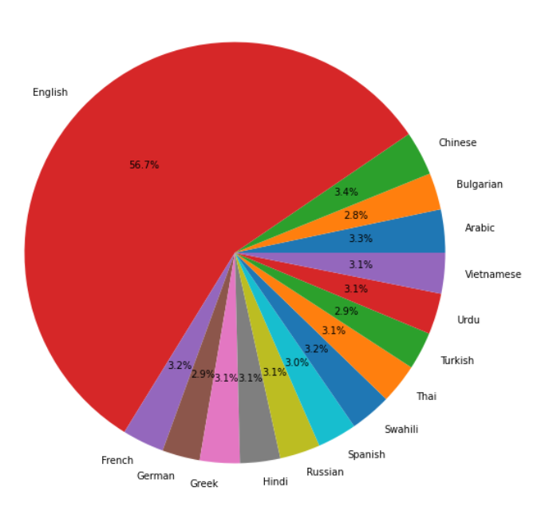

# Multi-Lingual-NLI
Natural Language Inferencing (NLI) is a popular NLP problem that involves determining how pairs of sentences (consisting of a premise and a hypothesis) are related.  
The aim of this project is to create an NLI model that assigns labels of 0, 1, or 2 (corresponding to entailment, neutral, and contradiction) to pairs of premises and hypotheses.
To make things more interesting, the train and test set include text in fifteen different languages.
Since dataset contains 15 different language we will use multi-lingual model which can be used to tokenize different language in a way that it can be useful for our model to classify
relation between two sentences.

In this project training is done with TPU which is provided by kaggle for faster execution. Overall it is a great project to understand how we can use NLP in our projects.
Dataset can be seen [here](https://www.kaggle.com/c/contradictory-my-dear-watson/data)
